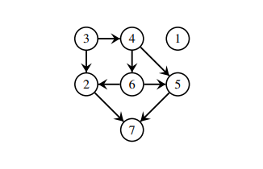
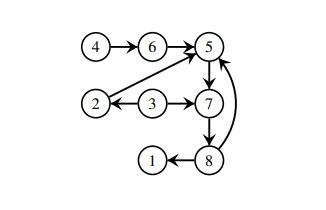

# Problem Description

Professor João is conducting a study for the government task force responsible for studying communicable diseases in Portugal.
The task force is particularly interested in the topic of disease transmission within the Portuguese population, aiming to study the best intervention mechanisms to contain the spread of disease.
To this end, Professor João had access to data from the TugaNet social network, which he believes is representative of real social interactions between individuals in the Brazilian population.
Thus, to study the worst-case scenario for the spread of a given infection in Portugal, Professor João wants to understand the maximum number of jumps a given disease can make.

However, given the density of Portuguese cities, Professor João decided to consider a simplifying assumption:
* individuals who know each other directly or indirectly become infected instantly.

## Input
**The input file contains information about the TugaNet network, which is defined as a directed graph of relationships between two individuals**, as follows:
- A line containing two integers: the number **n** of individuals (n ≥ 2), and the number of relationships **m** to be indicated (m ≥ 0);
- A list in which each line **i** contains two integers **x** and **y**, representing that individual **x** knows individual **y**.

Any integers in a line are separated by exactly one whitespace character, containing no other character except the end of the line.
**Assume that the input graphs are directed (potentially) cyclic.**

## Output
The program should write an integer **s** corresponding to the **maximum number of hops a disease can make in the TugaNet network**.

### Example 1



Input
```
7 8
3 4
3 2
4 6
4 5
6 2
6 5
5 7
2 7
```
Output esperado
`4`

> [!NOTE]
> In example 1, the largest number of hops corresponds to the longest path in the given graph, which is 4.

### Example 2



Input
```
8 9
2 5
3 2
3 7
4 6
5 7
6 5
7 8
8 1
8 5
```
Output esperado
`3`

> [!NOTE]
> In example 2, the largest number of hops is 3, not 5. Note that the given graph is cyclic, so we must use the simplifying assumption that individuals who know each other directly or indirectly become infected instantly. This means that cycles are collapsed into single vertices to compute the longest path.

----

## Optimizations
Given the difficulty reported by some students in achieving a correct project that passes all tests, and given that for projects with low computational complexity graphs, as is the case with this project, all small optimizations influence multiplicative constants, we suggest:
* using vector<vector<int>> instead of vector<list<int>> due to the overhead of using lists.
* using std::ios::sync_with_stdio(0); // disable synchronization with c libs (printf / scanf)
* using std::cin.tie(0); // discard cin buffer after each line of input


# Compilation
- C++: `g++ -std=c++11 -O3 -Wall file.cpp -lm`
- C: `gcc -O3 -ansi -Wall file.c -lm`
- Rust: `rustc --edition=2021 -C opt-level=3 file.rs`
- Javac: `javac File.java`
- Java: `java -Xss32m -Xmx256m -classpath . File`
- Python: `python3 file.py`

