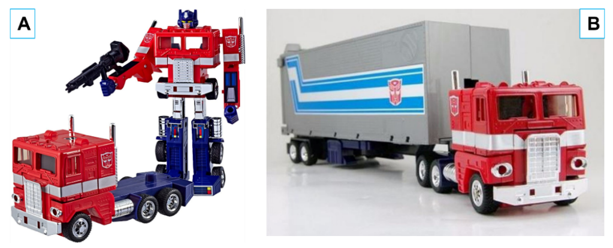
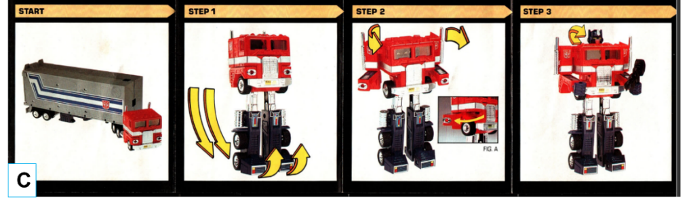
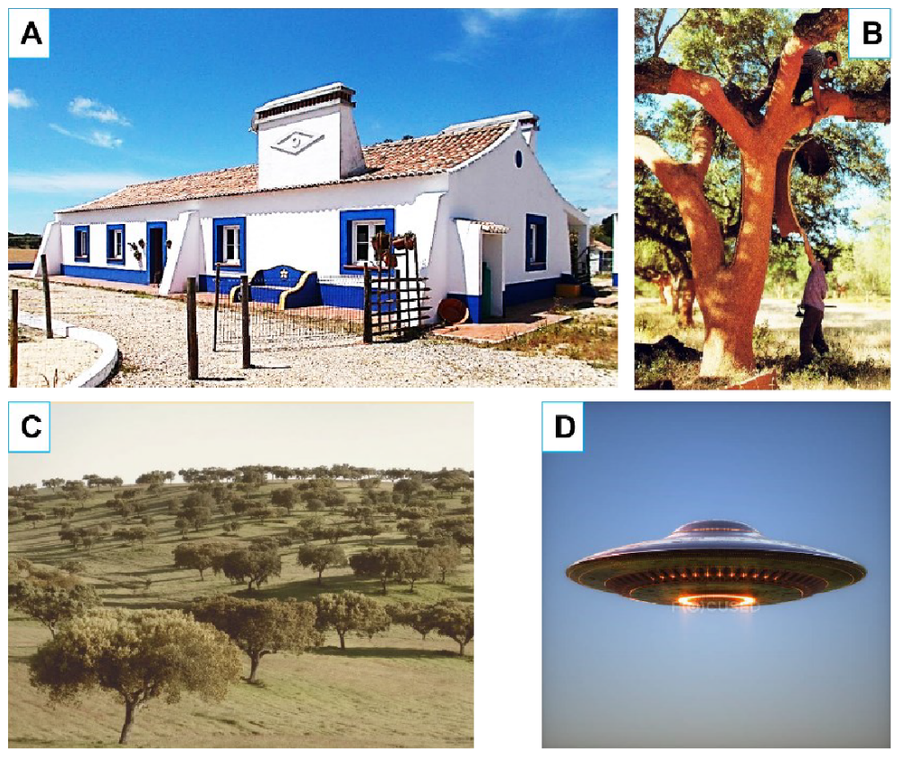

# Computer Graphics Project
This project consists of two assignments:
1. [Transformer](#transformer-truck--robot)
    - Model and animate a transformable robot and its trailer using geometric primitives (cubes, cylinders, cones). The robot can convert between robot and truck modes, with articulated parts controlled by keyboard input. The scene includes four fixed cameras (front, side, top, perspective) that can be switched via number keys. The trailer can be moved independently on the XZ plane, and collision detection is implemented to prevent it from intersecting the truck. The visual style can be toggled between wireframe and solid.

2. [UFO](#ufo)
    - Create a rural landscape with procedural textures for a flower field and a starry sky, a terrain mesh, a skydome, and a bright moon. The scene features multiple cork oak trees, an Alentejo house, and a UFO with animated lights and movement. The UFO can be controlled with the keyboard, and the scene supports switching between different material shading models (Lambert, Phong, Toon) and lighting modes. A stereoscopic camera is included for VR support.

<br>

To run the program:
```bash
python3 -m http.server 8080 --bind 127.0.0.1
```

## Transformer (Truck + Robot)
Interactive Scene with Fixed Cameras, Geometric Primitives Instancing, Simple Animations and Collisions

The objectives for this part are:
1. to understand and implement the architecture of an interactive graphical application;
2. explore the basic concepts of geometric modeling through primitive instantiation;
3. explore the concept of virtual camera;
4. understand the differences between orthographic projection and perspective projection;
5. apply basic animation techniques;
6. understand and implement simple collision detection techniques.

### Task 1
First, **set the scene background to a light color**.

Then **include fixed orthogonal projection cameras** with **front**, **side** and **top** views over the scene. These cameras must be oriented towards the center of the scene.

Further **define a fixed camera that allows viewing the entire scene via a perspective projection**. This camera must be positioned over the scene and oriented towards the center.

- It should be possible to switch between the four cameras using the number keys `1` (**front**), `2` (**side**), `3` (**top**) and `4` (**perspective**).

----

### Task 2
Model in Three.js a **simplified version of the transformable robot** shown in Figure 1 (A). Being an articulated object, it is necessary to **define a hierarchy of transformations between the different parts that make up the object**, in order to convert the robot into a truck and vice versa. The parts are as follows:
- head that includes details for eyes and antennas,
- arms with two exhaust pipes,
- forearms,
- chest,
- abdomen,
- waist,
- thighs,
- shanks,
- feet
- six wheels.


It is necessary to **model the parts using at least one of the following geometric primitives available in the Three.js** library: **cylinders**, **cubes** and **cones**.

> [!NOTE]
> Object sizing is free. The result must consist of at least a ‘low-poly’ approximation of the robot.

----

### Task 3
Also model in Three.js a **simplified version of the trailer** shown in Figure 1 (B). To do this, simply model the volume of the container, the four wheels and the connecting piece. It is necessary to model each of the parts using the Three.js cylinder and cube geometric primitives.

> [!NOTE]
> The trailer's dimensions are free, but according to the truck's dimensions. The result should consist of at least a ‘low-poly’ approximation of the trailer.

----

### Task 4
Allow the user to perform the conversion between robot-truck, that is, allow moving the degrees of freedom represented in Figure 1 (C) (see yellow arrows) using the following keys:

- `Q/q` and `A/a` to control the angle $\theta_1$ that **rotates the axis of revolution of the feet**;

- `W/w` and `S/s` to control the angle $\theta_2$ that **rotates the axis of revolution of the waist**;

- `E/e` and `D/d` to control the displacement $\delta_1$ that **translates the upper limbs medially and laterally**;

- and `R/r` and `F/f` to control the angle $\theta_3$ that **rotates the head’s axis of revolution**.

> [!NOTE]
> To simplify the problem, consider that the upper limbs do not rotate at the shoulder joint, but that they slide either moving away from or approaching the trunk. The articulated object must move at a constant speed, with the direction of movement given by a three-dimensional vector. The movement calculation must take into account that the user can press several keys simultaneously.

----

### Task 5
Allow the user to move the trailer around the invisible plane with the keyboard using the arrow keys to reposition it according to the global X and Z axes respectively. The trailer's reference must be aligned with the robot-truck's reference.

> [!NOTE]
> The movements of the truck must have a constant speed, with the direction of movement given by a three-dimensional vector. The movement calculation must take into account that the user can press several keys simultaneously. The trailer must initially be positioned on the back side of the robot truck without intercepting it.

----

### Task 6
The visual representation of scene objects should switch between wireframe and solid using the `7` key.

----

### Task 7
Implement collision detection between truck and trailer. Use AABB contact pairs to detect the collision, that is, both the truck and the trailer must have coupled collision geometries in the form of parallelepipeds aligned with the global reference frame of the scene. Upon collision, trigger an animation that moves the trailer to the connection point with the truck.

----





----

### Important notes

The implementation of all work developed in Computer Graphics laboratories must use the animation cycle (update/display cycle). This drawing pattern, used in interactive computer graphics applications, separates the drawing of the scene on the screen from the updating of the game state into two distinct phases.

In the display phase, three basic steps are completed: clear the buffer; draw the scene and force the processing of commands. In the update phase all game objects are updated according to the inherent physics. It is also at this stage that collision detection and implementation of the respective behaviors take place.


They must not use external libraries or Three.js functions to detect collisions or implement the physics inherent to motion. We expect to see your code and not calls to library functions.


In addition to the update and display events, there are a number of other events, such as key presses or releases, timers, and window resizing. We strongly suggest that such events be handled by the respective callback functions independently. Note that this assignment does not require proper implementation of window resizing events, but will be required in Assignment C.

The Three.js library already contains the main classes you need to develop the projects for this chair. This is why students should adopt object-oriented programming using the classes in this library, and should always follow good programming practices that allow code reuse in later releases and facilitate scalability.

<br>
<br>
<br>

## UFO
Interactive Scene with Meshes, Materials, Lights, Textures and Stereoscopic Camera

The objectives for this part are:
1. to understand the basics of lighting;
2. the concepts of material;
3. directional light sources and spotlight;
4. geometric modeling by instantiating primitives and creating polygon meshes;
5. to understand the basic principles of applying textures;
6. the fundamental principles of the stereoscopic camera.

### Task 1
Create a Three.js application dedicated to the procedural generation of textures that will be used to represent a field of flowers and a starry sky:
- the rural field will consist of hundreds of tiny white, yellow, lilac and light blue circles on a light green background;
- the starry sky will consist of a dotted area of ​​hundreds of white stars, represented by very small circles, on a linear gradient background from dark blue to dark violet.

The user can switch between generating the texture of the flower field and the starry sky using the keys `1` and `2`, respectively.

----

### Task 2
Create a Three.js application for the main scene. Generate a terrain with hills and valleys to resemble an Alentejo montado. To do this, use a [heightmap generator](https://manticorp.github.io/unrealheightmap/). In addition to the heightmap, apply the texture of the flower field generated in Task 1. Both textures must be applied to the mesh of a plane.

----

### Task 3
Create a skydome to wrap the terrain. Apply the texture of the starry sky generated in Task 1. This texture must be applied to the mesh of a sphere.

----

### Task 4
Add a full moon modeled by a sphere. Explore the emissivity properties of the material so that the moon is bright. Create the global illumination of the scene using a directional light source. The directional light source must be incident at a non-zero angle in relation to the normal of the xOy plane of the global scene reference. This light source must be able to be turned on or off using the `D/d` key.

----

### Task 5
Build a stripped cork oak tree using only cylinders and ellipsoids. One of the trunks must be slightly inclined, with a secondary branch with the opposite inclination interposed. The crown must be modeled with 1, 2 or 3 ellipsoids. The trunk and branch must be orange-brown in color, while the crown must be dark green. Place multiple instances of this cork oak tree on the terrain of Task 2, each instance having different heights, positions and orientations.

----

### Task 6
Build an Alentejo house using polygon meshes. To facilitate the construction of the meshes, it is suggested that you define only the visible faces of each piece (therefore, **it is not necessary to model the non-visible faces**!). Note that the windows, door(s) and the roof must be visible.

> [!NOTE]
> The result should consist of a ‘low-poly’ approximation of an Alentejo house.
> Windows and doors can be colored with a single tone (for example, blue), and no decorative effects are necessary on these components; the roof should be colored in an orange tone.
> Although it is optional, you can model the embroidery of the walls with bars of blue or yellow colors (i.e., a colored strip on the baseboard that follows the entire perimeter of the house).

----

### Task 7
Over the terrain and the house, you must orbit a flying saucer (i.e., a UFO). To do this, we suggest using a flattened sphere to model the body of the ship, a spherical dome to define the cockpit, and multiple small spheres placed radially on the bottom of the ship, as well as a flattened cylinder in the center of the bottom. Anchor a point light to each small sphere and a spotlight to the cylinder, with the latter light pointing downwards in the normal direction to the ship.

Point lights and spotlights can be activated or deactivated using the `P/p` key and the `S/s` key, respectively.

The ship must rotate around its axis of symmetry at a constant angular speed, and can move horizontally at a constant linear speed using the arrow keys.

The movement calculation must take into account that the user can press several keys simultaneously.

> [!Note]
> The spotlight lighting must be sufficient to be able to see the objects in the scene, but it does not need to illuminate them completely.

----

### Task 8
Define three material types (**MeshLambertMaterial**, **MeshPhongMaterial** and **MeshToonMaterial**) for each object in the scene. You should even be able to switch the shading type between Gouraud (diffuse), Phong and Cartoon using the `Q/q`, `W/w` and `E/e` keys respectively. You should also be able to toggle the lighting calculation on and off using an `R/r` key.

----

### Task 9

Define a fixed camera with a view over the entire scene using a perspective projection that can be selected using the ‘7’ key. Add a THREE.StereoCamera to the scene so that the application supports stereoscopic viewing on Virtual Reality (VR) devices. To do this, you should follow the official [documentation](https://threejs.org/manual/#en/how-to-create-vr-content) on how to create VR content for a web application. To run your application in a VR browser or on your smartphones, you should place the contents of your project (i.e. index.html, subfolder with JavaScript code, subfolder with textures) on a web page (e.g. Técnico’s personal homepage).

----



----

### Important notes

The Three.js library already contains the main classes needed to develop the projects in this course. It is therefore advisable that students adopt an object-oriented programming style using the classes in this library, and that they always follow good programming practices that allow code reuse in subsequent projects and facilitate scalability.

They cannot use 3D modeling tools. The meshes of the parts must be modeled manually, vertex by vertex, face to face.

To obtain good results when lighting large surfaces, they must be subdivided into smaller polygons.

All textures must react to lighting.

To use textures in local mode, it is necessary to configure browser permissions. The problem and the solution are described in the Three.js documentation.